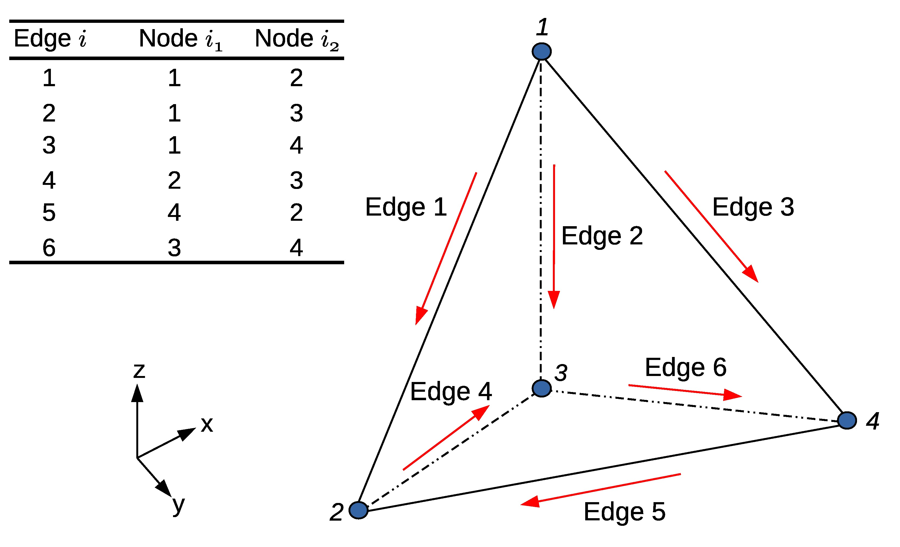

.. _CSEM & Edge elements formulation:

CSEM forward modelling & Edge elements formulation
==================================================

The last decade has been a period of rapid growth for electromagnetic
methods (EM) in geophysics, mostly because of their industrial adoption.
In particular, the 3D marine controlled-source electromagnetic (3D CSEM) method
has become an important technique for reducing ambiguities in data
interpretation in hydrocarbon exploration. In order to be able to predict
the EM signature of a given geological structure, modelling tools provide us
with synthetic results which we can then compare to measured data. In particular,
if the geology is structurally complex, one might need to use methods able
to cope with such complexity in a natural way by means of, e.g., an
unstructured mesh representing its geometry. Among the modelling methods
for EM based upon 3D unstructured meshes, the Nédélec Edge Finite Element
Method (EFEM) offers a good trade-off between accuracy and number of degrees
of freedom, e.g. size of the problem. Furthermore, its divergence-free basis
is very well suited for solving Maxwell’s equation. On top of that, we choose
to support tetrahedral meshes, as these are the easiest to use for very large
domains or complex geometries. We present the numerical formulation and
results of 3D CSEM forward modelling (FM) using tetrahedral EFEM on
unstructured meshes.

.. _CSEM problem:

CSEM problem
------------
3D CSEM FM is typically solved in frequency domain, which involves
the numerical solution of Maxwell’s equations in stationary regimes for
heterogeneous anisotropic electrically conductive domains. Furthermore,
CSEM surveys generally work with low frequency electromagnetic fields
(:math:`\sim` 1 Hz to :math:`\sim` 3 Hz) because the electric conductivity of the geological
structures is much larger than their dielectric permittivity. As a
consequence, in an unbound domain :math:`\Gamma`, the electric field
can be obtained by solving Maxwell’s equations in their diffusive form:

.. math::
   \nabla \times \mathbf{E} &= i\omega \mu_{0}\mathbf H  \\
	 \nabla \times \mathbf{H} &= \mathbf J_{s} + \tilde{\sigma}\mathbf E
   :label: maxwellDiffusive

where the harmonic time dependence :math:`e^{-i \omega t}` is omitted,
with :math:`\omega` is the angular frequency, :math:`\mu_{0}` the free
space magnetic permeability, :math:`\mathbf J_{s}` the distribution of
source current, :math:`\tilde{\sigma}\mathbf E` the induced current in
the conductive Earth and :math:`\tilde{\sigma}` the electrical conductivity
which is assumed isotropic for simplicity.

In numerical approximations of EM fields there are two main drawbacks.
The first one is the inevitable spatial singularity at the source. The
second is the grid refinement requirements in order to capture the rapid
change of the primary field [1]_. In order to mitigate these issues,
PETGEM used a secondary field approach where the total electric
field :math:`\mathbf E` is obtained as:

.. math::
   \mathbf E &= \mathbf E_{p} + \mathbf E_{s} \\
   \tilde{\sigma} &=  \tilde{\sigma_{s}} + \Delta \tilde{\sigma}
   :label: total_electric_field

where subscripts :math:`p` and :math:`s` represent a primary field and
secondary field respectively. For a general layered Earth model,
:math:`\mathbf E_{p}` can be computed semi-analytically by using Hankel
transform filters. Based on this decomposition and following the work by
[3]_ the equation system to solve :math:`\mathbf E_{s}` is:

.. math::
   \nabla \times \nabla \times \mathbf E_{s} + i \omega \mu \tilde{\sigma} \mathbf E_{s} = -i \omega \mu \Delta \sigma \mathbf E_{p}
   :label: electric_field_weak_form1

where the electrical conductivity :math:`\sigma` is a function of position
that is allowed to vary in 3D, whereas the vacuum permeability :math:`\mu`
is set to the free space value :math:`\mu_{0}`. Homogeneous Dirichlet
boundary conditions, :math:`\mathbf E_{s} = 0` on :math:`\partial\Gamma`,
are applied. The range of applicability of this conditions can be determined
based on the skin depth of the electric field [4]_.

.. _Edge finite element formulation:

Edge finite element formulation
-------------------------------
For the computation of :math:`\mathbf E_{s}`, PETGEM implemented the
Nédélec EFEM which uses vector basis functions defined on the edges of
the corresponding elements. Its basis functions are divergence-free but
not curl-free [2]_. Thus, EFEM naturally ensures tangential continuity and
allows normal discontinuity of :math:`\mathbf E_{s}` at material interfaces.
PETGEM used unstructured tetrahedral meshes because of their ability to
represent complex geological structures such as bathymetry or reservoirs as
well as the local refinement capability in order to improve the solution
accuracy. `Figure 4.1`_ shows the tetrahedral Nédélec elements (lowest order)
together with their node and edge indexing.

.. _Figure 4.1:

   Figure 4.1. Tetrahedral Nédélec edge element with node/edge indexing.

In PETGEM workflow, the tangential component of the secondary electric
field is assigned to the edges in the mesh. Therefore, all components of the
electric field at a point :math:`\mathbf x` located inside a tetrahedral
element :math:`e` can be obtained as follows:

.. math::
   \mathbf E^{e}(\mathbf x) = \sum_{i=1}^{6} \mathbf N^{e}_{i}(\mathbf x) E^{e}_{i}
   :label: field_components_edge_element

where :math:`\mathbf N^{e}_{i}` are the vector basis functions associated
to each edge :math:`i` and :math:`E^{e}_{i}` their degrees of freedom.
Considering the node and edge indexing in `Figure 4.1`_, the vector basis
functions can be expressed as follows:

.. math::
   \mathbf N^{e}_{i} &= (\lambda^{e}_{i1} \nabla \lambda^{e}_{i2} - \lambda^{e}_{i2} \nabla \lambda^{e}_{i1}) \ell^{e}_{i}
   :label: nedelec_basis

where subscripts :math:`i1` and :math:`i2` are the first and second nodes
linked to the :math:`i`-th edge, :math:`\lambda^{e}_{i}` are the linear
nodal basis functions, and :math:`\ell^{e}_{i}` is the length of the
:math:`i`-th edge of the element :math:`e`.

By substituting equation :eq:`field_components_edge_element` into
:eq:`electric_field_weak_form1`, and using Galerkin's approach, the weak
form of the original differential equation becomes:

.. math::
   Q_{i} = \int_{\Omega} \mathbf N_{i} \cdot [ \nabla \times \nabla \times \mathbf E_{s} -i \omega \mu \tilde{\sigma} \mathbf E_{s} + i \omega \mu \Delta \tilde{\sigma} \mathbf E_{p} ] dV
   :label: electric_field_weak_form2

The compact discretized form of :eq:`electric_field_weak_form2` is
obtained after applying the Green's theorem:

.. math::
   [K^{e}_{jk} + i \omega \tilde{\sigma}_{e} M^{e}_{jk}] \cdot  \{ E_{sk} \} = - i \omega \mu \Delta \tilde{\sigma}_{e} R^{e}_k
   :label: system_eq_edge_electric

where :math:`K^{e}` and :math:`M^{e}` are the elemental stiffness
and mass matrices which can be calculated analytically
or numerically [2]_, and :math:`R^{e}_k` is the right hand
side which requires numerical integration.

.. [1] Cai, H., Xiong, B., Han, M. and Zhdanov, M. (2014). 3D controlled-source electromagnetic modeling in anisotropic medium using edge-based finite element method. Computers & Geosciences, 73, 164–176.
.. [2] Jin, J. (2002). The Finite Element Method in Electromagnetics. Wiley, New York, second edn.
.. [3] Newman, G.A. and Alumbaugh, D.L. (2002). Three-dimensional induction logging problems, Part 2: A finite difference solution. Geophysics, 67(2), 484–491.
.. [4] Puzyrev, V., Koldan, J., de la Puente, J., Houzeaux, G., Vázquez, M. and Cela, J.M. (2013). A parallel finite-element method for three-dimensional controlled-source electromagnetic forward modelling. Geophysical Journal International, ggt027.
