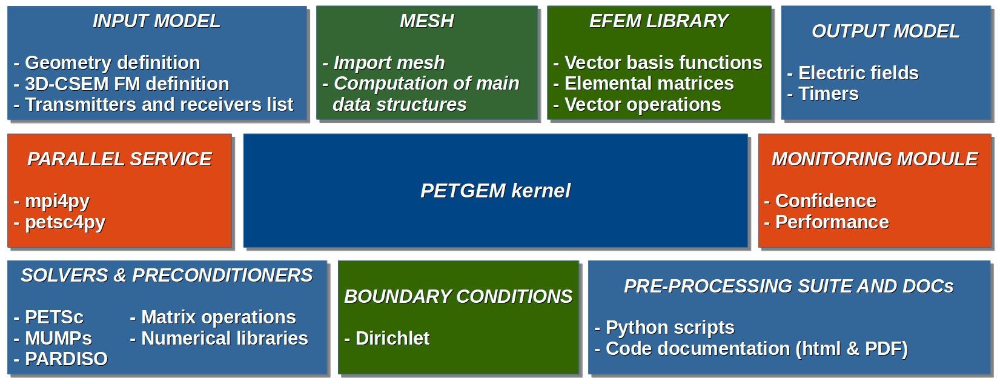

.. _Features:

Features
===============

PETGEM use a code structure for the high-order Nédélec FE algorithm that emphasizes
good parallel scalability, which is crucial in the multi-core era.
Furthermore, it’s modularity should simplify the process of reaching the
best possible performance in terms of percentage of the peak amount of
floating point operations provided by the architecture.

.. _Software stack:

Software stack
--------------
An outline of the primary groups of modules in PETGEM design is
given in `Figure 3.1`_.

.. _Figure 3.1:

   Figure 3.1. Upper view of PETGEM software stack.

A more detailed explanation is the following:

* Modular and extensible EFEM kernel: The kernel is extensible in any direction. Therefore, the possibility of adding new features such as new boundary conditions, numerical algorithms, analysis modules, among others.

* Independent of problem formulation, numerical solution, and data storage: The kernel provides the independent abstractions for modeling, numerical methods, data storage and analysis.

* Parallel processing support:  Based on distributed-memory parallelism (`petsc4py <https://pypi.python.org/pypi/petsc4py>`__) and static load balancing.  Further, GPUs architectures are supported.

* Confidence and performance monitoring: Based on an simple and automatic profiling module.

* Efficient solvers & preconditioners: Direct as well as iterative solvers and preconditioners are supported through `petsc4py <https://pypi.python.org/pypi/petsc4py>`__ package. As result, `PETSc <http://www.mcs.anl.gov/petsc/>`__ and `MUMPs <http://mumps.enseeiht.fr/>`__ libraries are supported.

* Interface to mesh generator: Simple and light library to export nodal finite element meshes to edge elements data structures. Current version support `Gmsh <http://gmsh.info/>`__ meshes.

* Edge FEM library: High-order Edge-based discretisations, vector basis functions, their geometry description, and generalized integration rules provides a generic support for implementing edge-based solution algorithms.

* Linear systems library: Support to Compressed Row Storage (CSR) format for sparse matrices and their easy and efficient parallel assembly on distributed-memory platforms.

* CSEM module: Ad-hoc design to meet specific requirements for the solution 3D CSEM surveys, namely, conductivity model, physical parameters, transmitter and receiver lists.

* Pre-processing suite: Set of `Python <https://www.python.org/>`__ functions for pre-processing phase within PETGEM.

* Documentation: Available in HTML and PDF format through `Sphinx <http://www.sphinx-doc.org>`__ and `LaTeX <https://www.latex-project.org/>`__ (textlive).

.. _Programming language:

Programming language
--------------------

PETGEM is based on `Python <https://www.python.org/>`__ language
programming because:

* It is open source and functional on a wide number of platforms, including HPC environments.
* It uses a high level and very expressive language.
* It is based on a sophisticated array manipulation in a Fortran-like manner.
* It uses a good body of bindings to common tools needed in scientific computing: plotting, numerical libraries, debugging and testing.

The code structure is modular, simple and flexible which allows exploiting
not just our own modules but also third party libraries. Therefore,
the software stack includes interfaces to external suites of data structures
and libraries that contain most of the necessary building blocks needed
for programming large scale numerical applications, e.g. sparse matrices,
vectors, iterative and direct solvers. As a result,
the code is compact and eliminates the need to write such libraries
and thus speeds up development time by orders of magnitude [1]_, [2]_,
[3]_, [4]_.

In order to meet the high computational cost of the modeling, PETGEM supports
distributed-memory parallelism through `Petsc4py <https://bitbucket.org/petsc/petsc4py>`__ package.

.. _Target architecture:

Target architecture
--------------------
The HPC goal of the PETGEM involves using cutting-edge architectures.
To that goal, the code is implemented in current state-of-the-art
platforms such as Intel Xeon Platinum processors from the Skylake generation,
Intel Haswell and Intel Xeon Phi processors, which offer
high-performance, flexibility, and power efficiency. Nevertheless,
PETGEM support older architectures such as SandyBridge, for the sake
of usability and to be able to compare performance.

.. [1] Bangerth, W., Burstedde, C., Heister, T., and Kronbichler, M. (2011). Algorithms and data structures for massively parallel generic adaptive finite element codes. ACM Transactions on Mathematical Software (TOMS), 38(2):14.
.. [2] Heister, T., Kronbichler, M., and Bangerth, W. (2010). Massively parallel finite element programming. Recent Advances in the Message Passing Interface, pages 122–131.
.. [3] Key, K. and Ovall, J. (2011). A parallel goal-oriented adaptive finite element method for 2.5-d electromagnetic modelling. Geophysical Journal International, 186(1):137– 154.
.. [4] Osseyran, A. and Giles, M. (2015). Industrial Applications of High-Performance Computing: Best Global Practices. Chapman & Hall/CRC Computational Science. CRC Press, first edition.
