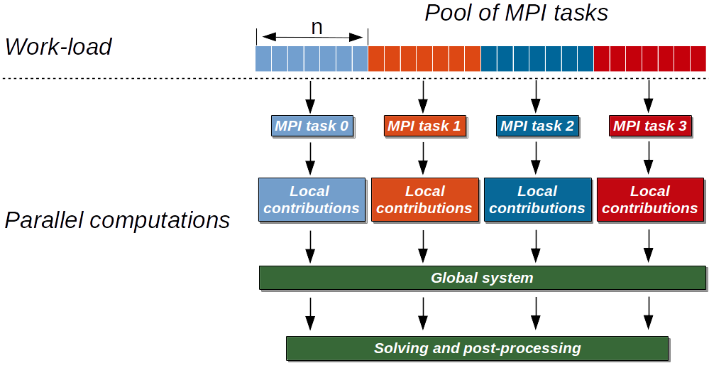
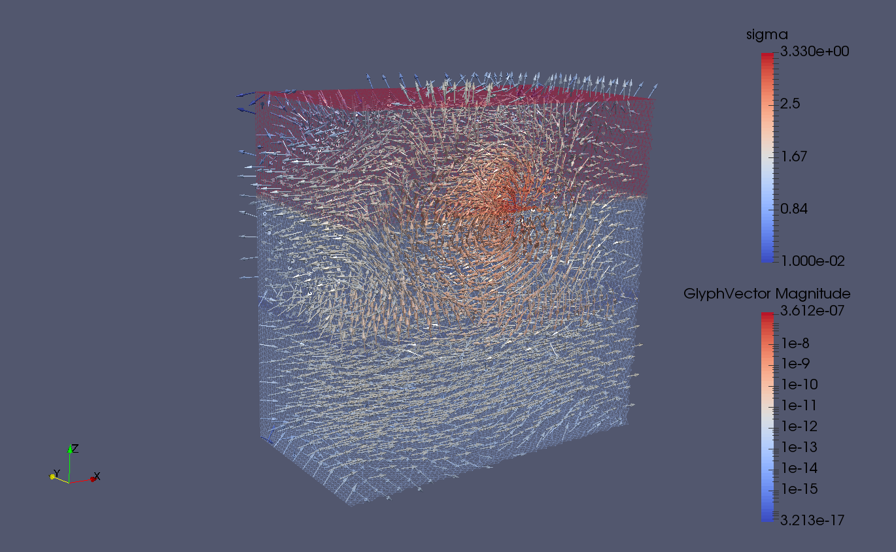
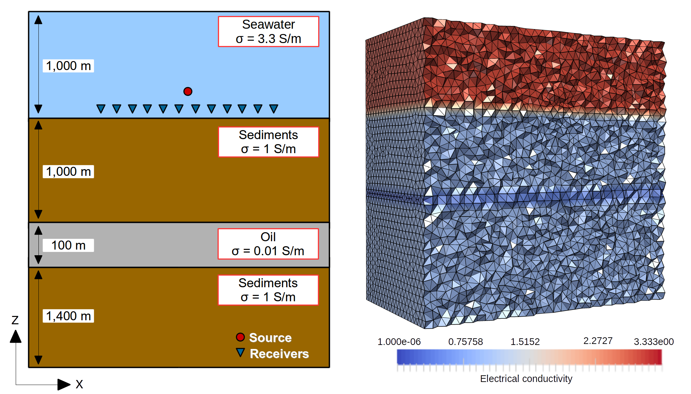
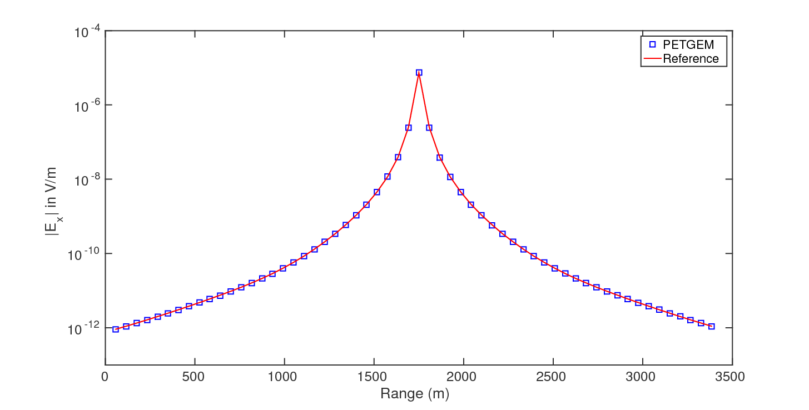
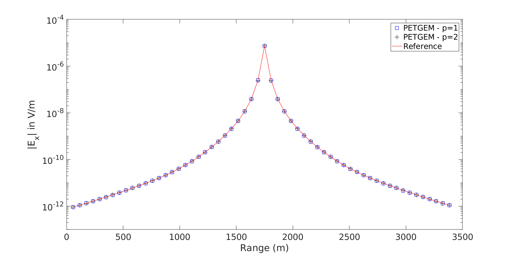

.. _Manual:

Manual
======

.. contents:: Table of contents
   :local:
   :backlinks: top

This manual provides reference documentation to PETGEM from a user’s and
developer's perspective.

.. _How generate documentation:

How generate documentation
-----------------------------

PETGEM is documented in PDF and HTML format using `Sphinx <http://www.sphinx-doc.org>`_ and
`LaTeX <https://www.latex-project.org/>`_. The documentation source
is in the ``doc/`` directory. The following steps summarize how to generate PETGEM documentation.

* Move to the PETGEM doc directory:

  .. code-block:: bash

    $ cd doc

* Generate the PETGEM documentation in HTML format by typing:

  .. code-block:: bash

    $ make html

* Or, if you prefer the PDF format by typing:

  .. code-block:: bash

    $ make latexpdf

* The previous steps will build the documentation in the ``doc/build`` directory. Alternatively, you can modify this path by editing the file ``setup.cfg`` and provide the required information below ``[build_sphinx]`` section:

  .. code-block:: bash

     [build_sphinx]
     source-dir = doc/source
     build-dir  = usr/local/path-build
     all_files  = 1

.. _Coding style:

Coding style
------------

PETGEM's coding style is based on
`PEP-0008 <https://www.python.org/dev/peps/pep-0008/>`_ guidelines. Main
guidelines are the following:

* 79 characteres per line.
* 4 spaces per indentation level.
* Variables are lower case meanwhile constants are upper case.
* Comments convention for functions is as follows:

  .. code-block:: bash

    def function(arg1, arg2):
        ''' This is a function.

            :param int arg1: array of dimensions ...
            :param str arg2: string that ...
        '''

* The use of inline comments is sparingly.
* Use of lowercase to name functions. Furthermore, functions names have following form: ``<actionSubject>()``, e.g. ``computeMatrix()``.
* Use of whole words instead abbreviations, examples:

  * Yes: ``solveSystem()``, ``computeEdges()``, ``computeMatrix()``.
  * No: ``solve()``, ``compEdges()``, ``compMatrix()``.

.. _PETGEM design:

PETGEM design
-------------

PETGEM use a code structure for the high-order Nédelec FE algorithm that emphasizes
good parallel scalability, which is crucial in the multi-core era.
Furthermore, it’s modularity should simplify the process of reaching the
best possible performance in terms of percentage of the peak amount of
floating point operations provided by the architecture. The code structure is
modular, simple and flexible which allows exploiting not just PETGEM modules
but also third party libraries. Therefore, the software stack includes
interfaces to external suites of data structures and libraries that contain
most of the necessary building blocks needed for programming large scale
numerical applications, i.e. sparse matrices, vectors, iterative and direct
solvers. As a result, the code is compact and
flexible whose main UML diagrams are described as follows.

PETGEM directory structure
******************************

This subsection is dedicated to list and describe the PETGEM directory
structure.

.. list-table:: Top directory structure
   :widths: 10 90
   :header-rows: 1

   * - Name
     - Description
   * - `doc/`
     - Source files for PETGEM documentation
   * - `examples/`
     - Templates of basic scripts for 3D CSEM modelling
   * - `petgem/`
     - Source code
   * - `kernel.py`
     - Heart of the code. This file contains the entire work-flow for a
       3D CSEM survey
   * - `DESCRIPTION.rst`
     - Summary of PETGEM features, requirements and installation instructions
   * - `LICENSE.rst`
     - License file
   * - `MANIFEST.in`
     - File with exact list of files to include in PETGEM distribution
   * - `README.rst`
     - Readme file
   * - `setup.py`
     - Main PETGEM setup script, it is based on Python setup-module
   * - `setup.cfg`
     - Setup configuration file for PETGEM setup script

The PETGEM source code is `petgem/`, which has the following contents:

.. list-table:: `petgem/` directory structure
   :widths: 10 90
   :header-rows: 1

   * - Name
     - Description
   * - `common.py`
     - Common classes and functions for init process.
   * - `hvfem.py`
     - General modules and classes for describing a 3D CSEM survey by using EFEM of
       high-order (:math:`p=1,2,3,4,5,6`) in tetrahedral meshes
   * - `mesh.py`
     - Interface to import mesh files
   * - `parallel.py`
     - Modules for supporting parallel computations and solution of 3D CSEM
   * - `preprocessing.py`
     - Modules for PETGEM pre-processing
   * - `solver.py`
     - Parallel functions within PETGEM and interface to `PETSc <https://www.mcs.anl.gov/petsc/>`__ solvers

.. _Running a simulation-Manual:

Running a simulation
--------------------

This section introduces the basics of running PETGEM on the command
line. In order to solve a 3D CSEM survey, the PETGEM kernel requires two
files, namely, the ``petsc.opts`` file and the ``params.yaml`` file, which
are described below.

Options for `PETSc <https://www.mcs.anl.gov/petsc/>`__ solvers/preconditioners
are accessible via the ``petsc.opts`` file, a glance of this is the
following:

.. code-block:: python

  # Solver options for PETSc
  -ksp_type gmres
  -pc_type sor
  -ksp_rtol 1e-8
  -ksp_converged_reason
  -ksp_monitor

Please, see `PETSc <https://www.mcs.anl.gov/petsc/>`__ documentation for more
details about available options. A template of this file is included in
``examples/`` of the PETGEM source tree. Additionally, a freely
available copy of this file is located at :ref:`Download` section.

On the other hand, any 3D CSEM survey should include: order for Nédélec elements
discretizations, physical parameters,
a mesh file, source and receivers files. These data are included in the
``params.yaml`` file. In order to avoid a specific parser, ``params.yaml``
file is imported by PETGEM as a Python dictionary. As consequence, the
dictionary name and his key names MUST NOT BE changed.

A glance of ``params.yaml`` file is the following:

.. code-block:: python

 ###############################################################################
 # PETGEM parameters file
 ###############################################################################
 # Model parameters
 model:
   mesh_file: examples/DIPOLE1D.msh      # Mesh file (gmsh format v2)
   basis_order: 1                        # Vector basis order (1,2,3,4,5,6)
   frequency: 2.0                        # Frequency
   src_position: [1750., 1750., -975.]   # Source position (xyz)
   src_azimuth: 0                        # Source rotation in xy plane
   src_dip: 0                            # Source rotation in xz plane
   src_current: 1.                       # Source current
   src_length: 1.                        # Source length
   sigma_horizontal: [1., 0.01, 1., 3.3333]   # Horizontal conductivity for each material
   sigma_vertical: [1., 0.01, 1., 3.3333]     # Vertical conductivity for each material
   receivers_file: examples/receiver_pos.h5 # Receiver positions file (xyz)

 # Execution parameters
 run:
   cuda: False                           # Flag to activate/deactivate cuda support

 # Output parameters
 output:
   directory: examples/out               # Directory for output (results)
   directory_scratch: examples/tmp       # Directory for temporal files

The ``params.yaml`` file is divided into 3 sections, namely, model,
run and output.

A template of ``params.yaml`` file is included in ``examples/``
of the PETGEM source tree. Additionally, a freely available copy of this file
is located at :ref:`Download` section.

Once the ``petsc.opts`` file and the ``params.yaml`` file are ready, the
PETGEM kernel is invoked as follows:

.. code-block:: bash

  $ mpirun -n MPI_tasks python3 kernel.py -options_file path/petsc.opts path/params.yaml

where ``MPI_tasks`` is the number of MPI parallel tasks, ``kernel.py`` is
the script that manages the PETGEM work-flow, ``petsc.opts`` is the
`PETSc <https://www.mcs.anl.gov/petsc/>`__ options file and ``params.yaml``
is the modelling parameters file for PETGEM.

PETGEM solves the problem and outputs the solution to the ``output.directory/`` path.
The output file will be in h5py format. By default, the file structure contains a
``electric_fields`` dataset and a ``receiver_coordinates`` dataset. In example, if the
model has 3 receivers, ``electric_fields.h5`` would contain the three
components (X, Y, Z) of the total electric field responses as follows (``electric_fields``):

.. code-block:: python

                 X-component	                                 Y-component    		                                   Z-component
  -4.5574552863437594e-13+7.1233021878258324e-13j 	4.6739135897834993e-14+2.5366912793221808e-14j 	  -3.1475221375383305e-13+3.7062683392960539e-13j
  -6.3279941549058795e-13+7.1644275969040401e-13j 	9.0092273989022595e-14+5.6392191941229304e-14j 	  -5.3662476008883527e-13+3.7808731666190081e-13j
  -1.0010652368597410e-12+7.0402832224144669e-13j 	1.0689234928043421e-13+3.6703286553521255e-14j 	  -7.8662575609351628e-13+3.6350095199855107e-13j

It is worth to mention the fields will be separated by real and imaginary component. On
the other hand, the receiver coordinates as follows (``receiver_coordinates``):

.. code-block:: python

    X	      Y    		  Z
  1750. 	 1750. 	  -990
  1800. 	 1750. 	  -990
  1850. 	 1750. 	  -990

In summary, for a general 3D CSEM survey, the ``kernel.py`` script follows
the next work-flow:

#. ``kernel.py`` reads a ``params.yaml``
#. Following the contents of the ``params.yaml``, a problem instance is created
#. Runs the data preprocessing
#. The problem sets up its domain, sub-domains, source, solver. This stage include the computation of the main data structures
#. Parallel assembling of :math:`Ax=b`.
#. The solution is obtained in parallel by calling a ``ksp()`` `PETSc <https://www.mcs.anl.gov/petsc/>`__ object.
#. Interpolation of electromagnetic responses and post-processing parallel stage
#. Finally the solution can be stored by calling ``solver.postprocess()`` method. Current version support `h5py <https://pypi.org/project/h5py/>`__ format.

Based on previous work-flow, any 3D CSEM modelling requires the following
input files:

#. A mesh file (current version supports mesh files in MSH ASCII format v2 from `Gmsh <http://gmsh.info/>`__)
#. A conductivity model associated with the materials defined in the mesh file
#. A list of receivers positions in hdf5 format for the electric responses post-processing
#. A ``params.yanl`` file where are defined the 3D CSEM parameters
#. A ``petsc.opts`` file where are defined options for `PETSc <https://www.mcs.anl.gov/petsc/>`__ solvers

During the preprocessing stage, the ``kernel.py`` generates the mesh file (`Gmsh <http://gmsh.info/>`__ format) with its
conductivity model and receivers positions in `PETSc <https://www.mcs.anl.gov/petsc/>`__ binary files.

For this phase, the supported/expected formats are the following:

* ``basis_order``: nédélec basis element order for the discretization. Supported orders are :math:`p=1,2,3,4,5,6`

* ``mesh_file``: path to tetrahedral mesh file in MSH ASCII format from `Gmsh <http://gmsh.info/>`__

* ``sigma``: numpy array where each value represents the horizontal and vertical conductivity for each material defined in ``mesh_file``. Therefore, size of ``sigma`` must match with the number of materials in ``mesh_file``

* ``receivers_file``: floating point values giving the X, Y and Z coordinates of each receiver in hdf5 format. Therefore, the number of receivers in the modelling will defined the number of the rows in ``receivers_file``, i.e. if the modelling has 3 receivers, ``receivers_file`` should be:

  .. code-block:: python

    5.8333300e+01   1.7500000e+03  -9.9000000e+02
    1.1666670e+02   1.7500000e+03  -9.9000000e+02
    1.7500000e+02   1.7500000e+03  -9.9000000e+02

* ``output_directory_scratch``: output scratch directory for pre-processing task

Once the previous information has been provided, the ``kernel.py``
script will generate all the input files required by PETGEM in order to
solve a 3D CSEM survey. The ``kernel.py`` output files list is the
following:

* ``nodes.dat``: floating point values giving the X, Y and Z coordinates of the four nodes that make up each tetrahedral element in the mesh. The dimensions of ``nodes.dat`` are given by (number-of-elements, 12)

* ``meshConnectivity.dat``: list of the node number of the n-th tetrahedral element in the mesh. The dimensions of ``meshConnectivity.dat`` are given by (number-of-elements, 4)

* ``dofs.dat``: list of degrees of freedom of the n-th tetrahedral element in the mesh. Since PETGEM is based on high-order Nédelec FE, the dimensions of ``dofs.dat`` are given by (number-of-elements, 6) for :math:`p=1`, by (number-of-elements, 20) for :math:`p=2`, by (number-of-elements, 45) for :math:`p=3`, by (number-of-elements, 84) for :math:`p=4`, by (number-of-elements, 140) for :math:`p=5`, and by (number-of-elements, 216) for :math:`p=6`.

* ``edges.dat``: list of the edges number of the n-th tetrahedral element in the mesh. The dimensions of ``edges.dat`` are given by (number-of-elements, 6)

* ``faces.dat``: list of the faces number of the n-th tetrahedral element in the mesh. The dimensions of ``faces.dat`` are given by (number-of-elements, 4)

* ``edgesNodes.dat``: list of the two nodes that make up each edge in the mesh. The dimensions of ``edgesNodes.dat`` are given by (number-of-edges, 2)

* ``faces.dat``: list of the four faces that make up each tetrahedral element in the mesh. The dimensions of ``faces.dat`` are given by (number-of-elements, 4)

* ``facesNodes.dat``: list of the three nodes that make up each tetrahedral face in the mesh. The dimensions of ``facesNodes.dat`` are given by (number-of-faces, 3)

* ``boundaries.dat``: list of the DOFs indexes that belongs on domain boundaries. The dimensions of ``boundaries.dat`` are given by (number-of-boundaries, 1)

* ``conductivityModel.dat``: floating point values giving the conductivity to which the n-th tetrahedral element belongs. The dimensions of ``conductivityModel.dat`` are given by (number-of-elements, 1)

* ``receivers.dat``: floating point values giving the X, Y and Z coordinates of the receivers. Additionally, this file includes information about the tetrahedral element that contains the n-th receiver, namely, its X, Y and Z coordinates of the four nodes, its list of the node number and its list of DOFs.

* ``nnz.dat``: list containing the number of nonzeros in the various matrix rows, namely, the sparsity pattern. According to the `PETSc <http://www.mcs.anl.gov/petsc/>`__ documentation, using the ``nnz.dat`` list to preallocate memory is especially important for efficient matrix assembly if the number of nonzeros varies considerably among the rows. The dimensions of ``nnz.dat`` are given by (number-of-DOFs, 1)

For each ``*.dat`` output file, the ``kernel.py`` script will
generate ``*.info`` files which are `PETSc <http://www.mcs.anl.gov/petsc/>`__
control information.

For post-processing stage (interpolation of electric responses at receivers
positions) a point location function is needed. For this task, PETGEM is based
on ``find_simplex`` function by `Scipy <https://docs.scipy.org/doc/>`__, which
find the tetrahedral elements (simplices) containing the given receivers
points. If some receivers positions are not found, PETGEM will print its
indexes and will save only those located points in the ``receivers.dat``
file.

.. _Mesh formats:

Mesh formats
------------

Current PETGEM version supports mesh files in MSH ASCII (version 2.2) from
`Gmsh <http://gmsh.info/>`__. Aforementioned format must be pre-processed
using the ``run_preprocessing.py`` script. The ``run_preprocessing.py``
script is included in the top-level directory of the PETGEM source tree.

.. _Available solvers:

Available solvers
-----------------

This section describes solvers available in PETGEM from an user's perspective.
Direct as well as iterative solvers and preconditioners are supported
through an interface to `PETSc <http://www.mcs.anl.gov/petsc/>`__ library.

PETGEM uses `petsc4py <https://pypi.python.org/pypi/petsc4py>`__ package in
order to support the Krylov Subspace Package (KSP) from
`PETSc <http://www.mcs.anl.gov/petsc/>`__. The object KSP provides an
easy-to-use interface to the combination of a parallel Krylov iterative method
and a preconditioner (PC) or a sequential/parallel direct solver. As result,
PETGEM users can set various solver options and preconditioner
options at runtime via the `PETSc <https://www.mcs.anl.gov/petsc/>`__ options
database. These parameters are defined in the ``petsc.opts`` file.

.. _Simulations in parallel:

Simulations in parallel
-----------------------
In FEM or HEFEM simulations, the need for efficient algorithms for assembling the
matrices may be crucial, especially when the DOFs is considerably large. This
is the case for realistic scenarios of 3D CSEM surveys because the required
accuracy. In such situation, assembly process remains a critical portion of
the code optimization since solution of linear systems which asymptotically
dominates in large-scale computing, could be done with linear solvers such
as `PETSc <http://www.mcs.anl.gov/petsc/>`__,
`MUMPs <http://mumps.enseeiht.fr/>`__,
`PARDISO <http://www.pardiso-project.org/>`__). In fact, in PETGEM V0.6,
the system assembly takes around $15\%$ of the total time.

The classical assembly in FEM or HEFEM programming is based on a loop over the
elements. Different techniques and algorithms have been proposed and nowadays is
possible performing these computations at the same time, i.e., to compute them in
parallel. However, parallel programming is not a trivial task in most programming
languages, and demands a strong theoretical knowledge about the hardware
architecture. Fortunately, `Python <https://www.python.org/>`__ presents user
friendly solutions for parallel computations, namely,
`mpi4py <https://pypi.python.org/pypi/mpi4py>`__ and
`petsc4py <https://pypi.python.org/pypi/petsc4py>`__ . These open-source
packages provides bindings of the MPI standard and the
`PETSc <http://www.mcs.anl.gov/petsc/>`__ library for the
`Python <https://www.python.org/>`__ programming language, allowing
any `Python <https://www.python.org/>`__ code to exploit multiple processors
architectures.

On top of that, `Figure 7.4`_ depicts shows an upper view of the matrix assembly
and solution using the `mpi4py <https://pypi.python.org/pypi/mpi4py>`_ and
`petsc4py <https://pypi.python.org/pypi/petsc4py>`__ package in PETGEM. The first
step is to partition the work-load into subdomains. This task can be done
by `PETSc <http://www.mcs.anl.gov/petsc/>`__ library, which makes load over
processes balanced. After domain partition, subdomains are assigned to MPI
tasks and the elemental matrices are calculated concurrently. These local
contributions are then accumulated into the global matrix system. The
process for global vector assembly is similar.

Subsequently, the system is ready to be solved. PETGEM uses the Krylov
Subspace Package (KSP) from `PETSc <http://www.mcs.anl.gov/petsc/>`__ through
the `petsc4py <https://pypi.python.org/pypi/petsc4py>`__ package. The KSP object
provides an easy-to-use interface to the combination of a parallel Krylov
iterative method and a preconditioner (PC) or a sequential/parallel direct
solver. As result, PETGEM users can set various solver options and
preconditioner options at runtime via the
`PETSc <http://www.mcs.anl.gov/petsc/>`__ options database. Since
`PETSc <http://www.mcs.anl.gov/petsc/>`__ knows which portions of the matrix
and vectors are locally owned by each processor, the post-processing task
is also completed in parallel.

All `petsc4py <https://pypi.python.org/pypi/petsc4py>`__ classes and
methods are called from the PETGEM kernel in a manner that allows a
parallel matrix and parallel vectors to be created automatically when the
code is run on many processors. Similarly, if only one processor is specified
the code will run in a sequential mode. Although
`petsc4py <https://pypi.python.org/pypi/petsc4py>`__ allows control the way
in which the matrices and vectors to be split across the processors
on the architecture, PETGEM simply let
`petsc4py <https://pypi.python.org/pypi/petsc4py>`__ decide the local sizes
in sake of computational flexibility. However, this can be modified in an
easy way without any extra coding required.

.. _Figure 7.4:

   Figure 7.4. Parallel scheme for assembly and solution in PETGEM using 4 MPI tasks. Here the elemental matrices computation is done in parallel. After calculations the global system is built and solved in parallel using the petsc4py and mpi4py packages.

.. _Visualization of results-Manual:

Visualization of results
------------------------

Once a solution of a 3D CSEM survey has been obtained, it should be
post-processed by using a visualization program. PETGEM does not do the
visualization by itself, but it generates output files (hdf5 is supported)
with the electric responses and receivers positions. It also gives timing values
in order to evaluate the performance.

`Figure 7.5`_ shows an example of PETGEM output for the first modelling case
(Canonical model of an off-shore hydrocarbon reservoir) described in
:ref:`Examples` section. `Figure 7.5`_ was obtained using
`Paraview <http://www.paraview.org/>`__.

.. _Figure 7.5:

   Figure 7.5. PETGEM vtk output.

.. _Examples:

Example
--------
This section includes a step-by-step walk-through of the process to solve a
simple 3D CSEM survey. The typical process to solve a problem using
PETGEM is followed: a model is meshed, PETGEM input files are preprocessed and modeled by
using ``kernel.py`` script to solve
the modelling and finally the results of the simulation are visualised.

All necessary data to reproduce the following examples are available in the
:ref:`Download` section.

Example 1: Canonical model of an off-shore hydrocarbon reservoir
****************************************************************

Model
#####

In order to explain the 3D CSEM modelling using PETGEM, here is considered the
canonical model by
`Weiss2006 <http://marineemlab.ucsd.edu/steve/bio/ThinResistors.pdf>`_ which
consists in four-layers: 1000 m thick seawater (3.3 :math:`S/m`), 1000 m thick sediments
(1 :math:`S/m`), 100 m thick oil (0.01 :math:`S/m`) and 1400 m thick sediments
(1 :math:`S/m`). The computational domain is a :math:`[0,3500]^3` m cube. For this model,
a 2 Hz x-directed dipole source is located at :math:`z=975`, :math:`x=1750`,
:math:`y=1750`. The receivers are placed in-line to the source position and along its
orientation, directly above the seafloor (:math:`z = 990`). Further, the
Nédélec element order is p=1 (first order)

Meshing
#######
PETGEM V1.0 is based on tetrahedral meshes. Therefore,  `Figure 7.8`_
shows a 3D view of the model with its unstructured tetrahedral mesh for
the halfspace :math:`y>1750`, with the color scale representing the electrical
conductivity :math:`\sigma` for each layer. Mesh in `Figure 7.8`_ have been
obtained using `Gmsh <http://gmsh.info/>`__.

.. _Figure 7.8:

   Figure 7.8. In-line canonical off-shore hydrocarbon model with its unstructured tetrahedral mesh for :math:`y>1750`. The color scale represents the electrical conductivity :math:`\sigma` for each layer.

In this case, the mesh is composed by four conductivity materials. Please, see
`Gmsh <http://gmsh.info/>`__ manual for details about the mesh creation process.

Parameters file for PETGEM
##########################
The parameters file used for this example follows:

.. code-block:: python

  ###############################################################################
  # PETGEM parameters file
  ###############################################################################
  # Model parameters
  model:
    mesh_file: case1/DIPOLE1D.msh      # Mesh file (gmsh format v2)
    basis_order: 1                        # Vector basis order (1,2,3,4,5,6)
    frequency: 2.0                        # Frequency
    src_position: [1750., 1750., -975.]   # Source position (xyz)
    src_azimuth: 0                        # Source rotation in xy plane
    src_dip: 0                            # Source rotation in xz plane
    src_current: 1.                       # Source current
    src_length: 1.                        # Source length
    sigma_horizontal: [1., 0.01, 1., 3.3333]   # Horizontal conductivity for each material
    sigma_vertical: [1., 0.01, 1., 3.3333]     # Vertical conductivity for each material
    receivers_file: case1/receiver_pos.h5 # Receiver positions file (xyz)

  # Execution parameters
  run:
    cuda: False                           # Flag to activate/deactivate cuda support

  # Output parameters
  output:
    directory: case1/out               # Directory for output (results)
    directory_scratch: case1/tmp       # Directory for temporal files

Note that you may wish to change the location of the input files to
somewhere on your drive. The solver options have been configured in the ``petsc.opts`` file as follows:

.. code-block:: python

    # Solver options for
    -ksp_type gmres
    -pc_type sor
    -ksp_rtol 1e-8
    -ksp_converged_reason
    -log_summary

That's it, we are now ready to solve the modelling.

Running PETGEM
##############
To run the simulation, the following command should be run in the top-level
directory of the PETGEM source tree:

.. code-block:: bash

  $ mpirun -n 16 python3 kernel.py -options_file case1/petsc.opts case1/params.yaml

``kernel.py`` solves the problem as follows:

#. Problem initialization
#. Preprocessing data
#. Import files
#. Parallel assembly system
#. Parallel solution system
#. Post-processing of electric responses

and outputs the solution to the output path
(``case1/out/``). The output file will be in hdf5 format.

PETGEM post-processing
######################
Once a solution of a 3D CSEM survey has been obtained, it should be
post-processed by using a visualization program. PETGEM does not do the
visualization by itself, but it generates output file (hdf5)
with the electric responses and receivers positions. It also gives timing values
in order to evaluate the performance.

The electric fields responses can be handled freely and plotted. The
dimension of the array is determined by the
number of receivers in the modelling (58 in this example). `Figure 7.9`_ shows
a comparison of the x-component of total electric field between PETGEM results
and the quasi-analytical solution obtained with the
`DIPOLE1D <http://marineemlab.ucsd.edu/~kkey/pubs/2009b.pdf>`_ tool. The total
electric field in `Figure 7.9`_ was calculated using a
mesh with :math:`\approx2` millions of DOFs.

.. _Figure 7.9:

   Figure 7.9. Total electric field comparative for x-component between PETGEM V1.0 and DIPOLE1D.

Example 2: Use of high-order Nédélec elements
*********************************************
In order to show the potential of high-order Nédélec elements, here is
considered the same model of previous example. In this case, the
Nédélec element order is p=2 (second order).

Meshing
##########################
As in previous example, the mesh is composed by four conductivity materials. The
resulting `Gmsh <http://gmsh.info/>`__ script can be found in :ref:`Download`
section. It is worth to mention that the use a Nédélec element order p=2 helps
to reduce the number of tetrahedral elements to achieved a certain error level.

Parameters file for PETGEM
##########################
The parameters file used for this example follows:

.. code-block:: python

  ###############################################################################
  # PETGEM parameters file
  ###############################################################################
  # Model parameters
  model:
    mesh_file: case2/DIPOLE1D.msh      # Mesh file (gmsh format v2)
    basis_order: 2                        # Vector basis order (1,2,3,4,5,6)
    frequency: 2.0                        # Frequency
    src_position: [1750., 1750., -975.]   # Source position (xyz)
    src_azimuth: 0                        # Source rotation in xy plane
    src_dip: 0                            # Source rotation in xz plane
    src_current: 1.                       # Source current
    src_length: 1.                        # Source length
    sigma_horizontal: [1., 0.01, 1., 3.3333]   # Horizontal conductivity for each material
    sigma_vertical: [1., 0.01, 1., 3.3333]     # Vertical conductivity for each material
    receivers_file: case2/receiver_pos.h5 # Receiver positions file (xyz)

  # Execution parameters
  run:
    cuda: False                           # Flag to activate/deactivate cuda support

  # Output parameters
  output:
    directory: case2/out               # Directory for output (results)
    directory_scratch: case2/tmp       # Directory for temporal files

Running PETGEM
##############
To run the simulation, the following command should be run in the top-level
directory of the PETGEM source tree:

.. code-block:: bash

  $ mpirun -n 48 python3 kernel.py -options_file case2/petsc.opts case2/params.yaml

``kernel.py`` solves the problem as follows:

#. Problem initialization
#. Preprocessing data
#. Import files
#. Parallel assembly system
#. Parallel solution system
#. Post-processing of electric responses

and outputs the solution to the output path
(``case2/out``). The output files will be in hdf5 format.

Nédélec order comparison
########################
`Figure 7.10`_ shows a comparison of the x-component of total electric field between p=1
and p=2 against the quasi-analytical solution obtained with the
`DIPOLE1D <http://marineemlab.ucsd.edu/~kkey/pubs/2009b.pdf>`_ tool. The total
electric field in `Figure 7.10`_ was calculated using a
mesh with :math:`\approx2` millions of DOFs for p=1 and a mesh with
:math:`\approx600` thousands of DOFs.

.. _Figure 7.10:

   Figure 7.10. Nédélec order comparative within PETGEM V1.0

Example 3: Use of PETSc solvers
*******************************

In PETGEM, options for `PETSc <https://www.mcs.anl.gov/petsc/>`__ solvers/preconditioners
are accessible via the ``petsc.opts`` file. Here is presented a short list of
relevant configuration options for the solution of the problem under
consideration.

* Direct solver by `MUMPs <http://mumps.enseeiht.fr/>`__ via `PETSc <https://www.mcs.anl.gov/petsc/>`__ interface

  .. code-block:: python

    # Solver options for PETSc
    -pc_type lu
    -pc_factor_mat_solver_package mumps

* Generalized minimal residual (GMRES) solver with a successive over-relaxation method (SOR) as preconditioner. Further, these options prints useful information: True residual norm, the preconditioned residual norm at each iteration and reason a iterative method was said to have converged or diverged.

  .. code-block:: python

    # Solver options for PETSc
    -ksp_type gmres
    -pc_type sor
    -ksp_rtol 1e-8
    -ksp_monitor_true_residual
    -ksp_converged_reason

* Generalized minimal residual (GMRES) solver with a geometric algebraic multigrid method (GAMG) as preconditioner.

  .. code-block:: python

    # Solver options for PETSc
    -ksp_type gmres
    -pc_type gamg
    -ksp_rtol 1e-8

* Generalized minimal residual (GMRES) solver with an additive Schwarz method (ASM) as preconditioner.

  .. code-block:: python

    # Solver options for PETSc
    -ksp_type gmres
    -pc_type asm
    -sub_pc_type lu
    -ksp_rtol 1e-8

* Generalized minimal residual (GMRES) solver with a Jacobi method as preconditioner.

  .. code-block:: python

    # Solver options for PETSc
    -ksp_type gmres
    -pc_type bjacobi
    -ksp_rtol 1e-8

* Transpose free quasi-minimal residual (TFQMR) solver with a successive over-relaxation method (SOR) as preconditioner.

  .. code-block:: python

    # Solver options for PETSc
    -ksp_type tfqmr
    -pc_type sor
    -ksp_rtol 1e-8

Previous configuration are based on most used in the literature.

.. _Code documentation:

Code documentation
------------------

Following sub-sections are dedicated to code documentation of PETGEM.

kernel
******

.. toctree::
   :maxdepth: 2

   petgem/kernel

Common scripts
**************

.. toctree::
   :maxdepth: 2

   petgem/common

Pre-processing
**************

.. toctree::
   :maxdepth: 2

   petgem/preprocessing

Mesh scripts
************

.. toctree::
   :maxdepth: 2

   petgem/mesh

HEFEM scripts
*************

.. toctree::
   :maxdepth: 2

   petgem/hvfem
   petgem/vectors

Solver
******

.. toctree::
   :maxdepth: 2

   petgem/solver

Parallel
********

.. toctree::
   :maxdepth: 2

   petgem/parallel
