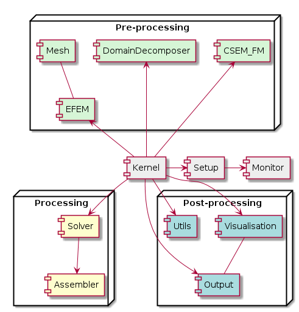
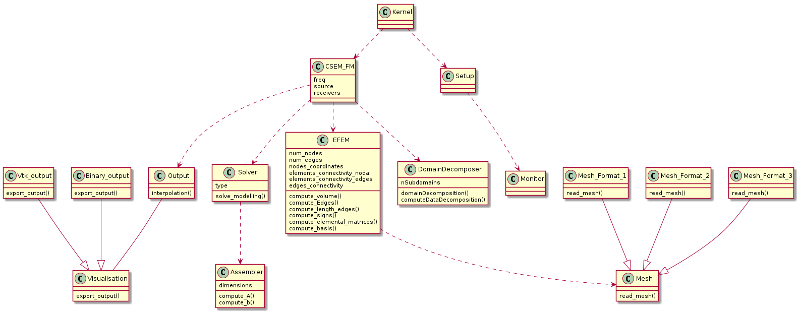
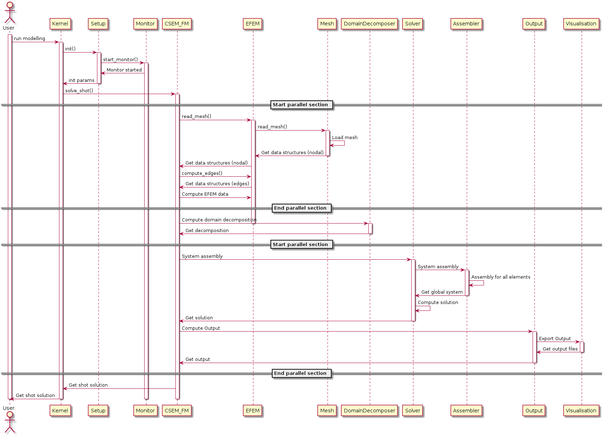
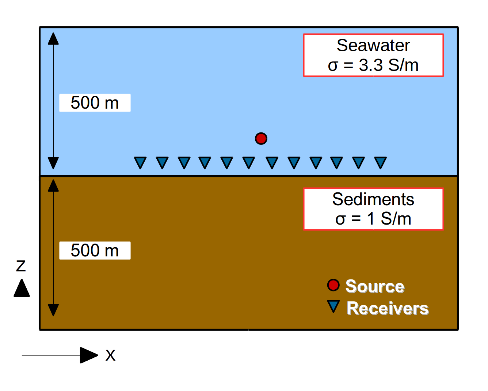
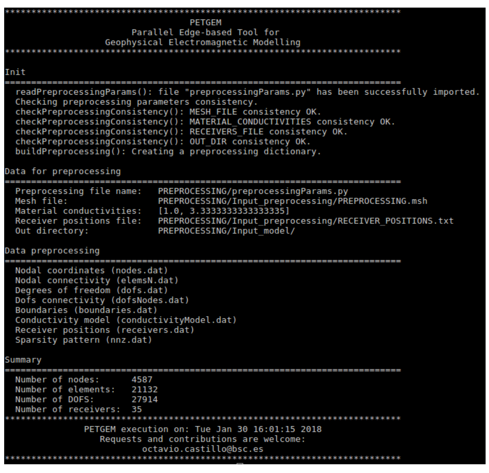

.. _Manual:

Manual
======

.. contents:: Table of contents
   :local:
   :backlinks: top

This manual provides reference documentation to PETGEM from a user’s and
developer's perspective.

.. _How generate documentation:

How generate documentation
-----------------------------

PETGEM is documented in PDF and HTML format using `Sphinx <http://www.sphinx-doc.org>`_ and
`LaTeX <https://www.latex-project.org/>`_. The documentation source
is in the ``doc/`` directory. The following steps summarize how to generate PETGEM documentation.

* Move to the PETGEM doc directory:

  .. code-block:: bash

    $ cd doc

* Generate the PETGEM documentation in HTML format by typing:

  .. code-block:: bash

    $ make html

* Or, if you prefer the PDF format by typing:

  .. code-block:: bash

    $ make latexpdf

* The previous steps will build the documentation in the ``doc/build`` directory. Alternatively, you can modify this path by editing the file ``setup.cfg`` and provide the required information below ``[build_sphinx]`` section:

  .. code-block:: bash

     [build_sphinx]
     source-dir = doc/source
     build-dir  = usr/local/path-build
     all_files  = 1

.. _Coding style:

Coding style
------------

PETGEM's coding style is based on
`PEP-0008 <https://www.python.org/dev/peps/pep-0008/>`_ guidelines. Main
guidelines are the following:

* 79 characteres per line.
* 4 spaces per indentation level.
* Variables are lower case meanwhile constants are upper case.
* Comments convention for functions is as follows:

  .. code-block:: bash

    def function(arg1, arg2):
        ''' This is a function.

            :param int arg1: array of dimensions ...
            :param str arg2: string that ...
        '''

* The use of inline comments is sparingly.
* Use of lowercase to name functions. Furthermore, functions names have following form: ``<actionSubject>()``, e.g. ``computeMatrix()``.
* Use of whole words instead abbreviations, examples:

  * Yes: ``solveSystem()``, ``computeEdges()``, ``computeMatrix()``.
  * No: ``solve()``, ``compEdges()``, ``compMatrix()``.

.. _PETGEM design:

PETGEM design
-------------

PETGEM use a code structure for the Nédelec FE algorithm that emphasizes
good parallel scalability, which is crucial in the multi-core era.
Furthermore, it’s modularity should simplify the process of reaching the
best possible performance in terms of percentage of the peak amount of
floating point operations provided by the architecture. The code structure is
modular, simple and flexible which allows exploiting not just PETGEM modules
but also third party libraries. Therefore, the software stack includes
interfaces to external suites of data structures and libraries that contain
most of the necessary building blocks needed for programming large scale
numerical applications, i.e. sparse matrices, vectors, iterative and direct
solvers. As a result, the code is compact and
flexible whose main UML diagrams are described as follows.

Component diagram
*****************

Main components of PETGEM are described in `Figure 7.1`_. Pre-processing,
processing and post-processing phases are included in `Figure 7.1`_.

.. _Figure 7.1:

   Figure 7.1. PETGEM: class diagram.

Class diagram
*************

Main classes for PETGEM are described in `Figure 7.2`_. Among all, the
``kernel`` class is the most important since it manage and control the others
classes, as consequence, ``kernel`` class is the start point for any
modelling.

.. _Figure 7.2:

   Figure 7.2. PETGEM: class diagram.

Sequence diagram
****************

`Figure 7.3`_ describe the sequence for a standard CSEM forward modelling.

.. _Figure 7.3:

   Figure 7.3. PETGEM: sequence diagram.

PETGEM directory structure
******************************

This subsection is dedicated to list and describe the PETGEM directory
structure.

.. list-table:: Top directory structure
   :widths: 10 90
   :header-rows: 1

   * - Name
     - Description
   * - `doc/`
     - Source files for PETGEM documentation
   * - `examples/`
     - Templates of basic scripts for 3D CSEM modelling
   * - `petgem/`
     - Source code
   * - `kernel.py`
     - Heart of the code. This file contains the entire work-flow for a
       3D CSEM survey
   * - `run_preprocessing.py`
     - Pre-processing script for PETGEM
   * - `AUTHORS`
     - Authors file
   * - `DESCRIPTION.rst`
     - Summary of PETGEM features, requirements and installation instructions
   * - `LICENSE.rst`
     - License file
   * - `MANIFEST.in`
     - File with exact list of files to include in PETGEM distribution
   * - `README.rst`
     - Readme file
   * - `setup.py`
     - Main PETGEM setup script, it is based on Python setup-module
   * - `setup.cfg`
     - Setup configuration file for PETGEM setup script

The PETGEM source code is `petgem/`, which has the following contents:

.. list-table:: `petgem/` directory structure
   :widths: 10 90
   :header-rows: 1

   * - Name
     - Description
   * - `base/`
     - Common classes and functions for init process.
   * - `efem/`
     - General modules and classes for describing a 3D CSEM  survey by using EFEM of
       lowest order in tetrahedral meshes
   * - `mesh/`
     - Interface to import mesh files
   * - `monitoring/`
     - Modules for PETGEM performance monitoring
   * - `parallel/`
     - Modules for supporting parallel assembling and solution of 3D CSEM
   * - `preprocessing/`
     - Modules for PETGEM pre-processing
   * - `solver/`
     - Parallel functions within PETGEM and interface to `PETSc <https://www.mcs.anl.gov/petsc/>`__ solvers

.. _Preprocessing-Manual:

Pre-processing
--------------
The first step for a 3D CSEM modelling using PETGEM is the pre-processing
phase. Here, a mesh file (`Gmsh <http://gmsh.info/>`__ format) with its
conductivity model and receivers positions are exported to
`PETSc <https://www.mcs.anl.gov/petsc/>`__ binary files.

The ``run_preprocessing.py`` script provides functions to change these data
into a representation that is more suitable for PETGEM. The
``run_preprocessing.py`` script is included in the top-level directory of
the PETGEM source tree.

The ``run_preprocessing.py`` script is invoked has follows:

.. code-block:: bash

  $ python3 run_preprocessing.py path/preprocessingParams.py

where ``preprocessingParams.py`` file contains parameters for the pre-processing
task. A glance of this file is the following:

.. code-block:: python

   # Parameters file template for PETGEM preprocessing. Here a mesh file, conductivity model and receivers file are mandatory.
   # In order to avoid a specific parser, this file is imported by PETGEM as a Python dictionary. As consequence, the dictionary
   # name and his key names MUST NOT BE changed. All file paths should consider as absolute.

   preprocessing = {
    # ---------- Mesh file ----------
    'MESH_FILE': 'DIPOLE1D/Input_preprocessing/DIPOLE1D.msh',

    # ---------- Material conductivities ----------
    'MATERIAL_CONDUCTIVITIES': [1.0, 1./100., 1., 1./.3],

    # ---------- Receivers positions file ----------
    'RECEIVERS_FILE': 'DIPOLE1D/Input_preprocessing/RECEIVER_POSITIONS.txt',

    # ---------- Path for Output ----------
    'OUT_DIR': 'DIPOLE1D/Input_model/',
    }

As you can see, in the ``preprocessingParams.py`` are defined the main parameters,
namely, mesh file path, material conductivities, receivers positions file path and the
pre-processing output path.

For this phase, the supported/expected formats are the following:

* ``MESH_FILE``: path to tetrahedral mesh file in MSH ASCII format from `Gmsh <http://gmsh.info/>`__

* ``MATERIAL_CONDUCTIVITIES``: numpy array where each value represents the conductivity for each material defined in ``MESH_FILE``. Therefore, size of ``MATERIAL_CONDUCTIVITIES`` must match with the number of materials in ``MESH_FILE``

* ``RECEIVERS_FILE``: floating point values giving the X, Y and Z coordinates of each receiver in ASCII format. Therefore, the number of receivers in the modelling will defined the number of the rows in ``RECEIVERS_FILE``, i.e. if the modelling has 3 receivers, ``RECEIVERS_FILE`` should be:

  .. code-block:: python

    5.8333300e+01   1.7500000e+03  -9.9000000e+02
    1.1666670e+02   1.7500000e+03  -9.9000000e+02
    1.7500000e+02   1.7500000e+03  -9.9000000e+02

* ``OUT_DIR``: output path for pre-processing task

Once the previous information has been provided, the ``run_preprocessing.py``
script will generate all the input files required by PETGEM in order to
solve a 3D CSEM survey. The ``run_preprocessing.py`` output files list is the
following:

* ``nodes.dat``: floating point values giving the X, Y and Z coordinates of the four nodes that make up each tetrahedral element in the mesh. The dimensions of ``nodes.dat`` are given by (number-of-elements, 12)

* ``meshConnectivity.dat``: list of the node number of the n-th tetrahedral element in the mesh. The dimensions of ``meshConnectivity.dat`` are given by (number-of-elements, 4)

* ``dofs.dat``: list of degrees of freedom of the n-th tetrahedral element in the mesh. Since PETGEM is based on linear Nédelec FE, the dimensions of ``dofs.dat`` are given by (number-of-elements, 6)

* ``dofsNodes.dat``: list of the two nodes that make up each degrees-of-freedom (DOFs) in the mesh. The dimensions of ``dofsNodes.dat`` are given by (number-of-dofs, 2)

* ``boundaries.dat``: list of the DOFs number that belongs on domain boundaries. The dimensions of ``boundaries.dat`` are given by (number-of-boundaries, 1)

* ``conductivityModel.dat``: floating point values giving the conductivity to which the n-th tetrahedral element belongs. The dimensions of ``conductivityModel.dat`` are given by (number-of-elements, 1)

* ``receivers.dat``: floating point values giving the X, Y and Z coordinates of the receivers. Additionally, this file includes information about the tetrahedral element that contains the n-th receiver, namely, its X, Y and Z coordinates of the four nodes, its list of the node number and its list of DOFs. The dimensions of ``receivers.dat`` are given by (number-of-receivers, 25)

* ``nnz.dat``: list containing the number of nonzeros in the various matrix rows, namely, the sparsity pattern. According to the `PETSc <http://www.mcs.anl.gov/petsc/>`__ documentation, using the ``nnz.dat`` list to preallocate memory is especially important for efficient matrix assembly if the number of nonzeros varies considerably among the rows. The dimensions of ``nnz.dat`` are given by (number-of-DOFs, 1)

For each ``*.dat`` output file, the ``run_preprocessing.py`` script will
generate ``*.info`` files which are `PETSc <http://www.mcs.anl.gov/petsc/>`__
control information.

For post-processing stage (interpolation of electric responses at receivers
positions) a point location function is needed. For this task, PETGEM is based
on ``find_simplex`` function by `Scipy <https://docs.scipy.org/doc/>`__, which
find the tetrahedral elements (simplices) containing the given receivers
points. If some receivers positions are not found, PETGEM will print its
indexes and will save only those located points in the ``receivers.dat``
file. Additionally, PETGEM will create ``receiversPETGEM.txt`` file with
floating point values giving the X, Y and Z coordinates of the located
receivers. Therefore, PETGEM will compute electric responses for located
receivers points.

A template of ``run_preprocessing.py``script is included in the top-level
directory of the PETGEM  source tree. On the other hand, a template of
``preprocessingParams.py`` is included in ``examples/``
of the PETGEM source tree. Additionally, a freely available copy of these files
is located at :ref:`Download` section.

.. _Running a simulation-Manual:

Running a simulation
--------------------

This section introduces the basics of running PETGEM on the command
line. In order to solve a 3D CSEM survey, the PETGEM kernel requires two
files, namely, the ``petsc.opts`` file and the ``modelParams.py`` file, which
are described below.

Options for `PETSc <https://www.mcs.anl.gov/petsc/>`__ solvers/preconditioners
are accessible via the ``petsc.opts`` file, a glance of this is the
following:

.. code-block:: python

   # Solver options for PETSc
   -ksp_type gmres
   -pc_type sor
   -ksp_rtol 1e-8
   -ksp_converged_reason
   -ksp_monitor

Please, see `PETSc <https://www.mcs.anl.gov/petsc/>`__ documentation for more
details about available options. A template of this file is included in
``examples/`` of the PETGEM source tree. Additionally, a freely
available copy of this file is located at :ref:`Download` section.

On the other hand, any 3D CSEM survey should include: physical parameters,
a mesh file, source and receivers files. These data are included in the
``modelParams.py`` file. Here all the files resulting from the pre-processing
phase are included. In order to avoid a specific parser, ``modelParams.py``
file is imported by PETGEM as a Python dictionary. As consequence, the
dictionary name and his key names MUST NOT BE changed.

A glance of ``modelParams.py`` file is the following:

.. code-block:: python

   # Parameters file template for 3D CSEM modelling.
   # By definition, any 3D CSEM survey should include: physical parameters, a mesh file, source and receivers files. These data
   # are included in the modelParams.py file. Additionally, options for PETSc solvers are defined in a petsc.opts file.
   # In order to avoid a specific parser, modelParams.py file is imported by PETGEM as a Python dictionary. As consequence,
   # the dictionary name and his key names MUST NOT BE changed. All file paths should consider as absolute.

   modelling = {
    # ----- Pyshical parameters -----
    # Source
    # Source frequency. Type: float
    # Optional: NO
    'FREQ': 2.0,
    # Source position(x, y, z). Type: float
    # Optional: NO
    'SRC_POS': [1750.0, 1750.0, -975.0],
    # Source orientarion. Type: int
    # 1 = X-directed source
    # 2 = Y-directed source
    # 3 = Z-directed source
    # Optional: NO
    'SRC_DIREC': 1,
    # Source current. Type: float
    # Optional: NO
    'SRC_CURRENT': 1.0,
    # Source length. Type: float
    # Optional: NO
    'SRC_LENGTH': 1.0,
    # Conductivity model. Type: str
    # Optional: NO
    'CONDUCTIVITY_MODEL_FILE': 'DIPOLE1D/Input_model/conductivityModel.dat',
    # Background conductivity. Type: float
    # Optional: NO
    'CONDUCTIVITY_BACKGROUND': 3.33,

    # ------- Mesh and conductivity model files ------
    # Mesh files
    # Nodes spatial coordinates. Type: str
    # Optional: NO
    'NODES_FILE': 'DIPOLE1D/Input_model/nodes.dat',
    # Elements-nodes connectivity. Type: str
    # Optional: NO
    'MESH_CONNECTIVITY_FILE': 'DIPOLE1D/Input_model/meshConnectivity.dat',
    # Elements-edges connectivity. Type: str
    # Optional: NO
    'DOFS_CONNECTIVITY_FILE': 'DIPOLE1D/Input_model/dofs.dat',
    # Edges-nodes connectivity. Type: str
    # Optional: NO
    'DOFS_NODES_FILE': 'DIPOLE1D/Input_model/dofsNodes.dat',
    # Sparsity pattern for matrix allocation (PETSc)
    'NNZ_FILE': 'DIPOLE1D/Input_model/nnz.dat',
    # Boundaries. Type: str
    # Optional: NO
    'BOUNDARIES_FILE': 'DIPOLE1D/Input_model/boundaries.dat',

    # ------------ Solver -----------
    # Solver options must be set in
    # petsc.opts file

    # ------------ Receivers file -----------
    # Name of the file that contains the receivers position. Type: str
    # Optional: NO
    'RECEIVERS_FILE': 'DIPOLE1D/Input_model/receivers.dat',
   }

The ``modelParams.py`` file is divided into 4 sections, namely, physical parameters
(frequency, source position, source current, source length, conductivity model,
background conductivity), mesh information (file path of nodal spatial coordinates,
mesh connectivity, DOFs connectivity, edges-nodes connectivity, sparsity
structure for `PETSc <https://www.mcs.anl.gov/petsc/>`__
matrix allocation and boundaries), solver parameters (solver type, tolerance, maximum
number of iterations which are defined in the ``petsc.opts`` file),
output information (receivers positions file path).

A template of ``modelParams.py`` file is included in ``examples/``
of the PETGEM source tree. Additionally, a freely available copy of this file
is located at :ref:`Download` section.

Once the ``petsc.opts`` file and the ``modelParams.py`` file are ready, the
PETGEM kernel is invoked as follows:

.. code-block:: bash

  $ mpirun -n MPI_tasks python3 kernel.py -options_file path/petsc.opts path/modelParams.py

where ``MPI_tasks`` is the number of MPI parallel tasks, ``kernel.py`` is
the script that manages the PETGEM work-flow, ``petsc.opts`` is the
`PETSc <https://www.mcs.anl.gov/petsc/>`__ options file and ``modelParams.py``
is the modelling parameters file for PETGEM.

PETGEM solves the problem and outputs the solution to the ``Output/`` path.
By default PETGEM will create the ``Output`` directory at same level where the
``modelParams.py`` file is located. The output files will be in three formats:
`PETSc <https://www.mcs.anl.gov/petsc/>`__, Matlab and ASCII. Therefore, the
``Output`` directory will contain three subdirectories: ``Ascii``, ``Matlab``
and ``Petsc``. By default, and for each format, PETGEM save the electric
field responses in different files:

* ``Ep.xx``: primary electric field components
* ``Es.xx``: secondary electric field components
* ``Et.xx``: total electric field components

where ``.xx`` is the file extension that depends of the format file. If the
model has 3 receivers, ``Et.dat`` (``ASCII`` format) would contain the three
components (X, Y, Z) of the total electric field responses as follows:

.. code-block:: python

  # Receiver			X-component	                                 Y-component    		                     Z-component
  0 	     -4.5574552863437594e-13+7.1233021878258324e-13j 	4.6739135897834993e-14+2.5366912793221808e-14j 	  -3.1475221375383305e-13+3.7062683392960539e-13j
  1 	     -6.3279941549058795e-13+7.1644275969040401e-13j 	9.0092273989022595e-14+5.6392191941229304e-14j 	  -5.3662476008883527e-13+3.7808731666190081e-13j
  2 	     -1.0010652368597410e-12+7.0402832224144669e-13j 	1.0689234928043421e-13+3.6703286553521255e-14j 	  -7.8662575609351628e-13+3.6350095199855107e-13j

In summary, for a general 3D CSEM survey, the ``kernel.py`` script follows
the next work-flow:

#. ``kernel.py`` reads a ``modelParams.py``
#. Following the contents of the ``modelParams.py``, a problem instance is created
#. The problem sets up its domain, sub-domains, source, solver. This stage include the computation of the main data structures
#. Parallel assembling of :math:`Ax=b`. See :ref:`CSEM problem` and :ref:`Edge finite element formulation` sections for a detail mathematical background of this equation system
#. The solution is obtained in parallel by calling a ``ksp()`` `PETSc <https://www.mcs.anl.gov/petsc/>`__ object.
#. Interpolation of electromagnetic responses & post-processing parallel stage
#. Finally the solution can be stored by calling ``postProcessingFields()`` function. Current version support `PETSc <https://www.mcs.anl.gov/petsc/>`__, Matlab and ASCII formats.

Based on previous work-flow, any 3D CSEM modelling requires the following
input files:

#. A mesh file (current version supports mesh files in MSH ASCII format from `Gmsh <http://gmsh.info/>`__)
#. A conductivity model associated with the materials defined in the mesh file
#. A list of receivers positions in ASCII format for the electric responses post-processing
#. A ``preprocessingParams.py`` file where are defined the pre-processing parameters
#. A ``modelParams.py`` file where are defined the 3D CSEM parameters
#. A ``petsc.opts`` file where are defined options for `PETSc <https://www.mcs.anl.gov/petsc/>`__ solvers
#. A ``run_preprocessing.py`` script and a ``kernel.py`` script which manage the pre-processing and modelling tasks respectively

.. _Mesh formats:

Mesh formats
------------

Current PETGEM version supports mesh files in MSH ASCII from
`Gmsh <http://gmsh.info/>`__. Aforementioned format must be pre-processed
using the ``run_preprocessing.py`` script. The ``run_preprocessing.py``
script is included in the top-level directory of the PETGEM source tree.

See :ref:`Preprocessing-Manual` section for more details
about ``run_preprocessing.py``.

.. _Available solvers:

Available solvers
-----------------

This section describes solvers available in PETGEM from an user's perspective.
Direct as well as iterative solvers and preconditioners are supported
through an interface to `PETSc <http://www.mcs.anl.gov/petsc/>`__ library.

PETGEM uses `petsc4py <https://pypi.python.org/pypi/petsc4py>`__ package in
order to support the Krylov Subspace Package (KSP) from
`PETSc <http://www.mcs.anl.gov/petsc/>`__. The object KSP provides an
easy-to-use interface to the combination of a parallel Krylov iterative method
and a preconditioner (PC) or a sequential/parallel direct solver. As result,
PETGEM users can set various solver options and preconditioner
options at runtime via the `PETSc <https://www.mcs.anl.gov/petsc/>`__ options
database. These parameters are defined in the ``petsc.opts`` file.

.. _Simulations in parallel:

Simulations in parallel
-----------------------
In FEM or EFEM simulations, the need for efficient algorithms for assembling the
matrices may be crucial, especially when the DOFs is considerably large. This
is the case for realistic scenarios of 3D CSEM surveys because the required
accuracy. In such situation, assembly process remains a critical portion of
the code optimization since solution of linear systems which asymptotically
dominates in large-scale computing, could be done with linear solvers such
as `PETSc <http://www.mcs.anl.gov/petsc/>`__,
`MUMPs <http://mumps.enseeiht.fr/>`__,
`PARDISO <http://www.pardiso-project.org/>`__). In fact, in PETGEM V1.0,
the system assembly takes around $15\%$ of the total time.

The classical assembly in FEM or EFEM programming is based on a loop over the
elements. Different techniques and algorithms have been proposed and nowadays is
possible performing these computations at the same time, i.e., to compute them in
parallel. However, parallel programming is not a trivial task in most programming
languages, and demands a strong theoretical knowledge about the hardware
architecture. Fortunately, `Python <https://www.python.org/>`__ presents user
friendly solutions for parallel computations, namely,
`mpi4py <https://pypi.python.org/pypi/mpi4py>`__ and
`petsc4py <https://pypi.python.org/pypi/petsc4py>`__ . These open-source
packages provides bindings of the MPI standard and the
`PETSc <http://www.mcs.anl.gov/petsc/>`__ library for the
`Python <https://www.python.org/>`__ programming language, allowing
any `Python <https://www.python.org/>`__ code to exploit multiple processors
architectures.

On top of that, `Figure 7.4`_ depicts shows an upper view of the matrix assembly
and solution using the `mpi4py <https://pypi.python.org/pypi/mpi4py>`_ and
`petsc4py <https://pypi.python.org/pypi/petsc4py>`__ package in PETGEM. The first
step is to partition the work-load into subdomains. This task can be done
by `PETSc <http://www.mcs.anl.gov/petsc/>`__ library, which makes load over
processes balanced. After domain partition, subdomains are assigned to MPI
tasks and the elemental matrices are calculated concurrently. These local
contributions are then accumulated into the global matrix system. The
process for global vector assembly is similar.

Subsequently, the system is ready to be solved. PETGEM uses the Krylov
Subspace Package (KSP) from `PETSc <http://www.mcs.anl.gov/petsc/>`__ through
the `petsc4py <https://pypi.python.org/pypi/petsc4py>`__ package. The KSP object
provides an easy-to-use interface to the combination of a parallel Krylov
iterative method and a preconditioner (PC) or a sequential/parallel direct
solver. As result, PETGEM users can set various solver options and
preconditioner options at runtime via the
`PETSc <http://www.mcs.anl.gov/petsc/>`__ options database. Since
`PETSc <http://www.mcs.anl.gov/petsc/>`__ knows which portions of the matrix
and vectors are locally owned by each processor, the post-processing task
is also completed in parallel following the numerical scheme
described in :ref:`CSEM problem` section.

All `petsc4py <https://pypi.python.org/pypi/petsc4py>`__ classes and
methods are called from the PETGEM kernel in a manner that allows a
parallel matrix and parallel vectors to be created automatically when the
code is run on many processors. Similarly, if only one processor is specified
the code will run in a sequential mode. Although
`petsc4py <https://pypi.python.org/pypi/petsc4py>`__ allows control the way
in which the matrices and vectors to be split across the processors
on the architecture, PETGEM simply let
`petsc4py <https://pypi.python.org/pypi/petsc4py>`__ decide the local sizes
in sake of computational flexibility. However, this can be modified in an
easy way without any extra coding required.

.. _Figure 7.4:
.. figure:: _static/figures/PETGEM_parallel_scheme.png
   :scale: 70%
   :alt: Parallel scheme for assembly in PETGEM V1.0.
   :align: center

   Figure 7.4. Parallel scheme for assembly and solution in PETGEM using 4 MPI tasks. Here the elemental matrices computation is done in parallel. After calculations the global system is built and solved in parallel using the petsc4py and mpi4py packages.

.. _Visualization of results-Manual:

Visualization of results
------------------------

Once a solution of a 3D CSEM survey has been obtained, it should be
post-processed by using a visualization program. PETGEM does not do the
visualization by itself, but it generates output files (ASCII,
`PETSc <https://www.mcs.anl.gov/petsc/>`__ and Matlab formats are supported)
with the electric responses at receivers positions. It also gives timing values
in order to evaluate the performance.

`Figure 7.5`_ shows an example of PETGEM output for the first modelling case
(Canonical model of an off-shore hydrocarbon reservoir) described in
:ref:`Examples` section. `Figure 7.5`_ was obtained using
`Paraview <http://www.paraview.org/>`__.

.. _Figure 7.5:
.. figure:: _static/figures/totalFieldVTK.png
   :scale: 50%
   :alt: PETGEM vtk output.
   :align: center

   Figure 7.5. PETGEM vtk output.

.. _Examples:

Examples
--------
This section includes a step-by-step walk-through of the process to solve a
simple 3D CSEM survey. The typical process to solve a problem using
PETGEM is followed: a model is meshed, PETGEM input files are preprocessed by
using ``run_preprocessing.py`` script (see :ref:`Preprocessing-Manual` section
for details), a ``modelParams.py`` file is drafted, PETGEM is run to solve
the modelling and finally the results of the simulation are visualised.

All necessary data to reproduce the following examples are available in the
:ref:`Download` section.

Example 1: Pre-processing data for PETGEM
*****************************************

Model
#####

In order to explain the PETGEM pre-processing stage, here is considered the
simple layer model of `Figure 7.6`_. The model consists in two-layers: 500 m
thick seawater (3.3 :math:`S/m`), 500 m thick sediments (1 :math:`S/m`).

.. _Figure 7.6:

   Figure 7.6. Simple conductivity for pre-processing stage in PETGEM

This model has been meshed using the `Gmsh <http://gmsh.info/>`__ tool. The
mesh geometry for this example is defined in the ``PREPROCESSING.geo`` script,
which content is the following:

.. code-block:: python

  /*********************************************************************
  *
  * Mesh for pre-processing stage in PETGEM (http://petgem.bsc.es/)
  *
  * Parameters:
  *    Conductivity [Sediments, Water] --> [1.0, 1.0/0.3] S/m
  *    x-dimensions --> [0.0, 1500.0] m
  *    y-dimensions --> [0.0, 1500.0] m
  *    z-dimensions --> [0, -1000.0] m
  *
  * Visit http://gmsh.info/ for details about mesh scripting with Gmsh
  *
  * by Octavio Castillo-Reyes, BSC-CASE (octavio.castillo@bsc.es)
  * Latest update: January 30th, 2018
  *********************************************************************/
  // #################################################################
  // #                        Parameters                             #
  // #################################################################
  // Dimensions
  MIN_X = -0.0;
  MAX_X = 1500.0;
  MIN_Y = 0.0;
  MAX_Y = 1500.0;
  MIN_Z = -1000.0;
  MAX_Z = 0.0;
  DEPTH_MATERIAL1 = -500.0;
  // Mesh size
  dg = 80;
  // #################################################################
  // #                    Define main points                         #
  // #################################################################
  Point (1) = {MIN_X, MIN_Y, MIN_Z};
  Point (2) = {MIN_X, MAX_Y, MIN_Z};
  Point (3) = {MAX_X, MAX_Y, MIN_Z};
  Point (4) = {MAX_X, MIN_Y, MIN_Z};
  Point (5) = {MIN_X, MIN_Y, DEPTH_MATERIAL1};
  Point (6) = {MIN_X, MAX_Y, DEPTH_MATERIAL1};
  Point (7) = {MAX_X, MAX_Y, DEPTH_MATERIAL1};
  Point (8) = {MAX_X, MIN_Y, DEPTH_MATERIAL1};
  Point (9) = {MIN_X, MIN_Y, MAX_Z};
  Point (10) = {MIN_X, MAX_Y, MAX_Z};
  Point (11) = {MAX_X, MAX_Y, MAX_Z};
  Point (12) = {MAX_X, MIN_Y, MAX_Z};

  // #################################################################
  // #                   Layer 1: Sediments (1.0 S/m)                #
  // #################################################################
  Line (1) = {1, 4};
  Line (2) = {4, 3};
  Line (3) = {3, 2};
  Line (4) = {2, 1};
  Line (5) = {1, 5};
  Line (6) = {4, 8};
  Line (7) = {3, 7};
  Line (8) = {2, 6};
  Line (9) = {5, 8};
  Line (10) = {8, 7};
  Line (11) = {7, 6};
  Line (12) = {6, 5};
  Line Loop (1) = {1, 2, 3, 4};
  Plane Surface (1) = {1};
  Line Loop (2) = {1, 6, -9, -5};
  Plane Surface (2) = {2};
  Line Loop (3) = {2, 7, -10, -6};
  Plane Surface (3) = {3};
  Line Loop (4) = {3, 8, -11, -7};
  Plane Surface (4) = {4};
  Line Loop (5) = {4, 5, -12, -8};
  Plane Surface (5) = {5};
  Line Loop (6) = {9, 10, 11, 12};
  Plane Surface (6) = {6};
  // Define Volume
  Surface Loop (1) = {1, 2, 3, 4, 5, 6};
  Volume (1) = {1};
  Physical Volume ("Sediments", 1) = {1};

  // #################################################################
  // #                 Layer 2: Water (1.0/0.3 S/m)                  #
  // #################################################################
  Line (13) = {8, 12};
  Line (14) = {7, 11};
  Line (15) = {6, 10};
  Line (16) = {5, 9};
  Line (17) = {9, 12};
  Line (18) = {12, 11};
  Line (19) = {11, 10};
  Line (20) = {10, 9};
  Line Loop (7) = {9, 13, -17, -16};
  Plane Surface (7) = {7};
  Line Loop (8) = {10, 14, -18, -13};
  Plane Surface (8) = {8};
  Line Loop (9) = {11, 15, -19,-14};
  Plane Surface (9) = {9};
  Line Loop (10) = {12, 16, -20, -15};
  Plane Surface (10) = {10};
  Line Loop (11) = {17, 18, 19, 20};
  Plane Surface (11) = {11};
  // Define Volume
  Surface Loop (2) = {6,7,8,9,10,11};
  Volume (2) = {2};
  Physical Volume ("Water", 2) = {2};

  // #################################################################
  // #                Mesh parameters                                #
  // #################################################################
  Characteristic Length {1, 2, 3, 4, 5, 6, 7, 8, 9 , 10, 11, 12, 13, 14, 15, 16, 17, 18, 19, 20} = dg;

Once the mesh have been created, the PETGEM pre-processing is invoked as
follows:

.. code-block:: bash

  $ python3 run_preprocessing.py PREPROCESSING/preprocessingParams.py

where ``preprocessingParams.py`` file contains parameters for the pre-processing
task. A glance of this script is the following:

.. code-block:: python

   # Parameters file template for PETGEM preprocessing. Here a mesh file, conductivity model and receivers file are mandatory.
   # In order to avoid a specific parser, this file is imported by PETGEM as a Python dictionary. As consequence, the dictionary
   # name and his key names MUST NOT BE changed. All file paths should consider as absolute.

   preprocessing = {
    # ---------- Mesh file ----------
    'MESH_FILE': 'PREPROCESSING/Input_preprocessing/PREPROCESSING.msh',

    # ---------- Material conductivities ----------
    'MATERIAL_CONDUCTIVITIES': [1., 1./.3],

    # ---------- Receivers positions file ----------
    'RECEIVERS_FILE': 'PREPROCESSING/Input_preprocessing/RECEIVER_POSITIONS.txt',

    # ---------- Path for Output ----------
    'OUT_DIR': 'Input_model/',
    }

As you can see, in the ``preprocessingParams.py`` are defined the main parameters,
namely, mesh file path, material conductivities, receivers positions file path and the
pre-processing output path.

The expected output of this phase is show in `Figure 7.7`_.

.. _Figure 7.7:

   Figure 7.7. PETGEM output for pre-processing stage

Previous task, will prepare all input files for 3D CSEM modeling within
PETGEM. Please, see :ref:`Preprocessing-Manual` section for details about
pre-processing output files.

Example 2: Canonical model of an off-shore hydrocarbon reservoir
****************************************************************

Model
#####

In order to explain the 3D CSEM modelling using PETGEM, here is considered the
canonical model by
`Weiss2006 <http://marineemlab.ucsd.edu/steve/bio/ThinResistors.pdf>`_ which
consists in four-layers: 1000 m thick seawater (3.3 :math:`S/m`), 1000 m thick sediments
(1 :math:`S/m`), 100 m thick oil (0.01 :math:`S/m`) and 1400 m thick sediments
(1 :math:`S/m`). The computational domain is a :math:`[0,3500]^3` m cube. For this model,
a 2 Hz x-directed dipole source is located at :math:`z=975`, :math:`x=1750`,
:math:`y=1750`. The receivers are placed in-line to the source position and along its
orientation, directly above the seafloor (:math:`z = 990`).

Meshing
#######
PETGEM V1.0 is based on tetrahedral meshes of lowest order. Therefore,  `Figure 7.8`_
shows a 3D view of the model with its unstructured tetrahedral mesh for
the halfspace :math:`y>1750`, with the color scale representing the electrical
conductivity :math:`\sigma` for each layer. Mesh in `Figure 7.8`_ have been
obtained using `Gmsh <http://gmsh.info/>`__.

.. _Figure 7.8:
.. figure:: _static/figures/model1.png
   :scale: 35%
   :alt: In-line canonical off-shore hydrocarbon model with its unstructured tetrahedral mesh for :math:`y>150`
   :align: center

   Figure 7.8. In-line canonical off-shore hydrocarbon model with its unstructured tetrahedral mesh for :math:`y>1750`. The color scale represents the electrical conductivity :math:`\sigma` for each layer.

In this case, the mesh is composed by four conductivity materials. Please, see
`Gmsh <http://gmsh.info/>`__ manual for details about the mesh creation process.

PETGEM pre-processing
#####################
The next step in the process is the PETGEM input files construction. These files can be
created using the ``run_preprocessing.py`` script. For this modelling,
``run_preprocessing.py`` should be invoked has follows:

.. code-block:: bash

  $ python3 run_preprocessing.py DIPOLE1D/preprocessingParams.py

``run_preprocessing.py`` script will create 8 files in binary
`PETSc <https://www.mcs.anl.gov/petsc/>`__ format:
``nodes.dat``, ``meshConnectivity.dat``, ``dofs.dat``, ``dofsNodes.dat``,
``boundaries.dat``, ``conductivityModel.dat``, ``receivers.dat`` and
``nnz.dat`` with its corresponding ``*.info`` files.

Parameters file for PETGEM
##########################
The parameters file structure for PETGEM is well documented in
:ref:`Running a simulation-Manual` section. The parameters file used for
this example follows:

.. code-block:: python

  # Parameters file template for 3D CSEM modelling.
  # By definition, any 3D CSEM survey should include: physical parameters, a mesh file, source and receivers files. These data
  # are included in the modelParams.py file. Additionally, options for PETSc solvers are defined in a petsc.opts file.
  # In order to avoid a specific parser, modelParams.py file is imported by PETGEM as a Python dictionary. As consequence,
  # the dictionary name and his key names MUST NOT BE changed. All file paths should consider as absolute.

  modelling = {
   # ----- Pyshical parameters -----
   # Source
   # Source frequency. Type: float
   # Optional: NO
   'FREQ': 2.0,
   # Source position(x, y, z). Type: float
   # Optional: NO
   'SRC_POS': [1750.0, 1750.0, -975.0],
   # Source orientarion. Type: int
   # 1 = X-directed source
   # 2 = Y-directed source
   # 3 = Z-directed source
   # Optional: NO
   'SRC_DIREC': 1,
   # Source current. Type: float
   # Optional: NO
   'SRC_CURRENT': 1.0,
   # Source length. Type: float
   # Optional: NO
   'SRC_LENGTH': 1.0,
   # Conductivity model. Type: str
   # Optional: NO
   'CONDUCTIVITY_MODEL_FILE': 'DIPOLE1D/Input_model/conductivityModel.dat',
   # Background conductivity. Type: float
   # Optional: NO
   'CONDUCTIVITY_BACKGROUND': 3.33,

   # ------- Mesh and conductivity model files ------
   # Mesh files
   # Nodes spatial coordinates. Type: str
   # Optional: NO
   'NODES_FILE': 'DIPOLE1D/Input_model/nodes.dat',
   # Elements-nodes connectivity. Type: str
   # Optional: NO
   'MESH_CONNECTIVITY_FILE': 'DIPOLE1D/Input_model/meshConnectivity.dat',
   # Elements-edges connectivity. Type: str
   # Optional: NO
   'DOFS_CONNECTIVITY_FILE': 'DIPOLE1D/Input_model/dofs.dat',
   # Edges-nodes connectivity. Type: str
   # Optional: NO
   'DOFS_NODES_FILE': 'DIPOLE1D/Input_model/dofsNodes.dat',
   # Sparsity pattern for matrix allocation (PETSc)
   'NNZ_FILE': 'DIPOLE1D/Input_model/nnz.dat',
   # Boundaries. Type: str
   # Optional: NO
   'BOUNDARIES_FILE': 'DIPOLE1D/Input_model/boundaries.dat',

   # ------------ Solver -----------
   # Solver options must be set in
   # petsc.opts file

   # ------------ Receivers file -----------
   # Name of the file that contains the receivers position. Type: str
   # Optional: NO
   'RECEIVERS_FILE': 'DIPOLE1D/Input_model/receivers.dat',
  }

Note that you may wish to change the location of the input files to
somewhere on your drive. By default PETGEM will create the ``Output`` directory
at same level where the ``modelParams.py`` file is located. For this example
and following the `PETSc <https://www.mcs.anl.gov/petsc/>`__ documentation,
the solver options have been configured in the ``petsc.opts`` file as follows:

.. code-block:: python

  # Solver options for PETSc
  -ksp_type gmres
  -pc_type sor
  -ksp_rtol 1e-8
  -ksp_converged_reason
  -log_summary

That's it, we are now ready to solve the modelling.

Running PETGEM
##############
To run the simulation, the following command should be run in the top-level
directory of the PETGEM source tree:

.. code-block:: bash

  $ mpirun -n 16 python3 kernel.py -options_file DIPOLE1D/petsc.opts DIPOLE1D/modelParams.py

``kernel.py`` solves the problem as follows:

#. Problem initialization
#. Import files
#. Parallel assembly system
#. Parallel solution system
#. Post-processing of electric responses

and outputs the solution to the output path
(``DIPOLE1D/Output/``). The output files will be in three formats:
`PETSc <https://www.mcs.anl.gov/petsc/>`__, Matlab and ASCII. Therefore, the
``Output`` directory will contain three subdirectories: ``Ascii``, ``Matlab``
and ``Petsc``. By default, and for each format, PETGEM save the electric
field responses in different files:

* ``Ep.xx``: primary electric field components
* ``Es.xx``: secondary electric field components
* ``Et.xx``: total electric field components

where ``.xx`` is the file extension that depends of the format file.

PETGEM post-processing
######################
Once a solution of a 3D CSEM survey has been obtained, it should be
post-processed by using a visualization program. PETGEM does not do the
visualization by itself, but it generates output files (ASCII,
`PTSc <https://www.mcs.anl.gov/petsc/>`__ and Matlab formats are supported)
with the electric responses at receivers positions. It also gives timing values
in order to evaluate the performance.

The ``Ep.xx``, ``Es.xx`` and ``Et.xx`` fields can be handled freely and plotted. The
dimension of arrays ``Ep.xx``, ``Es.xx`` and ``Et.xx`` is determined by the
number of receivers in the modelling (58 in this example). `Figure 7.9`_ shows
a comparison of the x-component of total electric field between PETGEM results
and the quasi-analytical solution obtained with the
`DIPOLE1D <http://marineemlab.ucsd.edu/~kkey/pubs/2009b.pdf>`_ tool. The total
electric field in `Figure 7.9`_ was calculated using a
mesh with :math:`\approx2` millions of DOFs.

.. _Figure 7.9:
.. figure:: _static/figures/total_field_X_model1.png
   :scale: 50%
   :alt: In-line canonical off-shore hydrocarbon model with its unstructured tetrahedral mesh for :math:`y>150`
   :align: center

   Figure 7.9. Total electric field comparative for x-component between PETGEM V1.0 and DIPOLE1D.

Example 3: Use of PETSc solvers
*******************************

In PETGEM, options for `PETSc <https://www.mcs.anl.gov/petsc/>`__ solvers/preconditioners
are accessible via the ``petsc.opts`` file. Here is presented a short list of
relevant configuration options for the solution of the problem under
consideration.

* Direct solver by `MUMPs <http://mumps.enseeiht.fr/>`__ via `PETSc <https://www.mcs.anl.gov/petsc/>`__ interface

  .. code-block:: python

    # Solver options for PETSc
    -pc_type lu
    -pc_factor_mat_solver_package mumps

* Generalized minimal residual (GMRES) solver with a successive over-relaxation method (SOR) as preconditioner. Further, these options prints useful information: True residual norm, the preconditioned residual norm at each iteration and reason a iterative method was said to have converged or diverged.

  .. code-block:: python

    # Solver options for PETSc
    -ksp_type gmres
    -pc_type sor
    -ksp_rtol 1e-8
    -ksp_monitor_true_residual
    -ksp_converged_reason

* Generalized minimal residual (GMRES) solver with a geometric algebraic multigrid method (GAMG) as preconditioner.

  .. code-block:: python

    # Solver options for PETSc
    -ksp_type gmres
    -pc_type gamg
    -ksp_rtol 1e-8

* Generalized minimal residual (GMRES) solver with an additive Schwarz method (ASM) as preconditioner.

  .. code-block:: python

    # Solver options for PETSc
    -ksp_type gmres
    -pc_type asm
    -sub_pc_type lu
    -ksp_rtol 1e-8

* Generalized minimal residual (GMRES) solver with a Jacobi method as preconditioner.

  .. code-block:: python

    # Solver options for PETSc
    -ksp_type gmres
    -pc_type bjacobi
    -ksp_rtol 1e-8

* Transpose free quasi-minimal residual (TFQMR) solver with a successive over-relaxation method (SOR) as preconditioner.

  .. code-block:: python

    # Solver options for PETSc
    -ksp_type tfqmr
    -pc_type sor
    -ksp_rtol 1e-8

Previous configuration are based on most used in the literature.

.. _Code documentation:

Code documentation
------------------

Following sub-sections are dedicated to code documentation of PETGEM.

Setup & install scripts
***********************

.. toctree::
   :maxdepth: 2

   setup/setup

kernel
******

.. toctree::
   :maxdepth: 2

   petgem/kernel/kernel

Base scripts
************

.. toctree::
   :maxdepth: 2

   petgem/base/basis_scripts
   petgem/base/styles
   petgem/base/modelling

Pre-processing
**************

.. toctree::
   :maxdepth: 2

   petgem/preprocessing/preprocessing

Mesh scripts
************

.. toctree::
   :maxdepth: 2

   petgem/mesh/mesh

EFEM scripts
************

.. toctree::
   :maxdepth: 2

   petgem/efem/efem
   petgem/efem/fem
   petgem/efem/vectorMatrixFunctions

Solver
******

.. toctree::
   :maxdepth: 2

   petgem/solver/assembler
   petgem/solver/solver

Parallel
********

.. toctree::
   :maxdepth: 2

   petgem/parallel/parallel

Post-processing
***************

.. toctree::
   :maxdepth: 2

   petgem/postprocessing/postprocessing

Monitoring
**********

.. toctree::
   :maxdepth: 2

   petgem/monitoring/monitoring

Examples
********

.. toctree::
   :maxdepth: 2

   examples/preprocessingParams
   examples/modelParams
